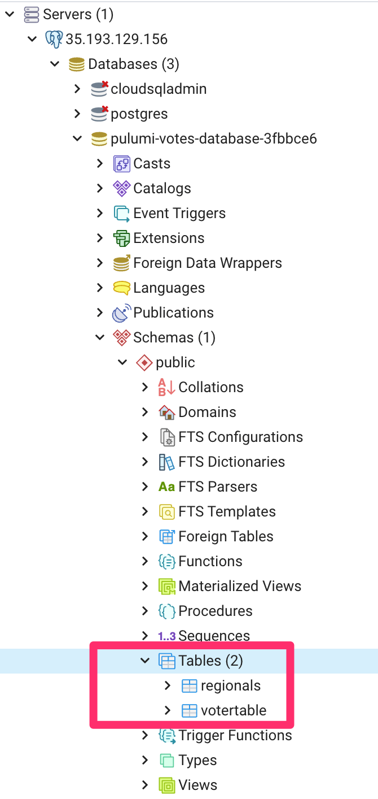

[](https://app.pulumi.com/new)

#  Postgressql with tables on GCP Cloud SQL in Python

### What Is This?
 
  This example creates uses gcp.  We are creating a google cloud sql instance, then using the postgres provider to create the database.  Then we are using the pg8000 to create tables and delete tables. This is done in Python 

## Prerequisites

* [Install Pulumi](https://www.pulumi.com/docs/get-started/install/)
* [Configure Pulumi to access your Google Cloud Account](https://www.pulumi.com/docs/get-started/gcp/begin/#configure-pulumi-to-access-your-google-cloud-account) 

## Running the Example
1.  Initialize a new stack called: `dev` via [pulumi stack init](https://www.pulumi.com/docs/reference/cli/pulumi_stack_init/). 
      ```
      $ pulumi stack init dev
      ```
1.  Create a Python virtualenv, activate it, and install dependencies:

    This installs the dependent packages [needed](https://www.pulumi.com/docs/intro/concepts/how-pulumi-works/) for our Pulumi program.

    ```bash
    $ python3 -m venv venv
    $ source venv/bin/activate
    $ pip3 install -r requirements.txt
    ```

1. Populate the config via [pulumi config set](https://www.pulumi.com/docs/reference/cli/pulumi_config_set/).
    
   Here are the gcp [regions](https://cloud.google.com/about/locations)
  
   ```
   $ pulumi config set gcp:project mycurrent-project1  # replace mycurrent-project1
   $ pulumi config set gcp:region us-central1 # Pick any region you want
   $ pulumi config set myip 123.345.67.890/32 --secret # This is your ip, in case you want to connect to the sql server via gui
   ```
   
1. Run `pulumi up` to preview and deploy changes: You must select `y` to continue
    ```
    Previewing update (dev)

    View Live: https://app.pulumi.com/shaht/gcp-postgres-py/dev/previews/17139a25-5e58-4f63-9b07-93095bcbc010

        Type                            Name                   Plan       
    +   pulumi:pulumi:Stack             gcp-postgres-py-dev    create     
    +   ├─ random:index:RandomPassword  randompassword         create     
    +   ├─ gcp:sql:DatabaseInstance     pulumidbinstance       create     
    +   ├─ gcp:sql:User                 users                  create     
    +   ├─ pulumi:providers:postgresql  postgres-provider      create     
    +   └─ postgresql:index:Database    pulumi-votes-database  create     
    
    Resources:
        + 6 to create

    Do you want to perform this update?  [Use arrows to move, enter to select, type to filter]
    > yes
      no
      details

    Updating (dev)

    View Live: https://app.pulumi.com/shaht/gcp-postgres-py/dev/updates/1

        Type                            Name                   Status      
    +   pulumi:pulumi:Stack             gcp-postgres-py-dev    created     
    +   ├─ random:index:RandomPassword  randompassword         created     
    +   ├─ gcp:sql:DatabaseInstance     pulumidbinstance       created     
    +   ├─ gcp:sql:User                 users                  created     
    +   ├─ pulumi:providers:postgresql  postgres-provider      created     
    +   └─ postgresql:index:Database    pulumi-votes-database  created     
    
    Outputs:
        Postgres_SQL_Database_Name             : "pulumi-votes-database-3fbbce6"
        Postgres_SQL_Instance                  : "pulumidbinstance-0668a3c"
        Postgres_SQL_Instance_Port             : "5432"
        Postgres_SQL_Instance_Public_Ip_Address: "35.193.129.156"
        Postgres_SQL_User_Password             : "[secret]"
        Postgres_SQL_User_Username             : "pulumiadmin"
        gcp_region                             : "us-central1"
        random_password                        : "[secret]"

    Resources:
        + 6 created

    Duration: 14m0s  
    ```
1. View the [stack outputs](https://www.pulumi.com/docs/reference/cli/pulumi_stack_output/) via: `pulumi stack output`
    ```
    pulumi stack output
    Current stack outputs (8):
        OUTPUT                                   VALUE
        Postgres_SQL_Database_Name               pulumi-votes-database-3fbbce6
        Postgres_SQL_Instance                    pulumidbinstance-0668a3c
        Postgres_SQL_Instance_Port               5432
        Postgres_SQL_Instance_Public_Ip_Address  35.193.129.156
        Postgres_SQL_User_Password               [secret]
        Postgres_SQL_User_Username               pulumiadmin
        gcp_region                               us-central1
        random_password                          [secret]
    ```
1. Table creation & deletion configuration setup. We are using [pg8000](https://github.com/tlocke/pg8000) to create and delete tables. To avoid hard coding values in your file, you can pass them in as [secret](https://www.pulumi.com/docs/intro/concepts/secrets/#secrets) [configs](https://www.pulumi.com/docs/intro/concepts/config/#setting-and-getting-configuration-values)
1. We will pass in the postgres instance, database, username, and password as config values set as secret.  The values of these are from the stack output above.
We need to see the secret values so we can pass them in as secrets again.  To do that, type in `pulumi stack output --show-secrets`
    ```
    pulumi stack output --show-secrets
    Current stack outputs (8):
        OUTPUT                                   VALUE
        Postgres_SQL_Database_Name               pulumi-votes-database-3fbbce6
        Postgres_SQL_Instance_Public_Ip_Address  35.193.129.156
        Postgres_SQL_User_Password               13LoRw9v0iQB
        Postgres_SQL_User_Username               pulumiadmin
    ```

1. Set config values as secret via:  [pulumi config set](https://www.pulumi.com/docs/reference/cli/pulumi_config/)
   ```
   $ pulumi config set postgres_sql_instance_public_ip_address 35.193.129.156 --secret
   $ pulumi config set postgres_sql_database_name pulumi-votes-database-3fbbce6 --secret
   $ pulumi config set postgres_sql_user_username pulumiadmin --secret
   $ pulumi config set postgres_sql_user_password 13LoRw9v0iQB --secret
   ```
1. View the config file to verify that the values are set as secret.
   
   `pulumi config`
    ```
    KEY                                      VALUE
    gcp:project                              pulumi-ce-team
    gcp:region                               us-central1
    myip                                     [secret]
    postgres_sql_database_name               [secret]
    postgres_sql_instance_public_ip_address  [secret]
    postgres_sql_user_password               [secret]
    postgres_sql_user_username               [secret]
    postgres_user_pwd                        [secret]
    ```
  1. Uncomment out the following: `creating_table=` to create the table in `__main__.py`. This is ~128.
     Before:  
     ```
     ##creating_table = tablecreation(create_table)
     ```
     After:  
     ```
     creating_table = tablecreation(create_table)
     ```
1. Run `pulumi up` and select `y`
    ```
    pulumi up
    Previewing update (dev)

    View Live: https://app.pulumi.com/shaht/gcp-postgres-py/dev/previews/e735d94b-0fd4-4309-9a3a-2ba82e8935c9

        Type                 Name                 Plan     Info
        pulumi:pulumi:Stack  gcp-postgres-py-dev           12 messages
    
    Diagnostics:
      pulumi:pulumi:Stack (gcp-postgres-py-dev):
        tablecreation with: votertable
        tablecreation create_combined_sql: CREATE TABLE IF NOT EXISTS votertable(id serial PRIMARY KEY, email VARCHAR ( 255 ) UNIQUE NOT NULL, api_key VARCHAR ( 255 ) NOT NULL)
        tablecreation starting
        Table Created: votertable
        SELECT Version: [['PostgreSQL 12.5 on x86_64-pc-linux-gnu, compiled by Debian clang version 10.0.1 , 64-bit']]
        tablecreation with: regionals
        tablecreation create_combined_sql: CREATE TABLE IF NOT EXISTS regionals(id serial PRIMARY KEY, email VARCHAR ( 255 ) UNIQUE NOT NULL, api_key VARCHAR ( 255 ) NOT NULL)
        tablecreation starting
        Table Created: regionals
        SELECT Version: [['PostgreSQL 12.5 on x86_64-pc-linux-gnu, compiled by Debian clang version 10.0.1 , 64-bit']]
        droptable delete_combined_sql  DROP TABLE IF EXISTS  table2  CASCADE
        droptable completed  []
    

    Do you want to perform this update?  [Use arrows to move, enter to select, type to filter]
      yes
    > no
      details
    Updating (dev)

    View Live: https://app.pulumi.com/shaht/gcp-postgres-py/dev/updates/2

        Type                 Name                 Status     Info
        pulumi:pulumi:Stack  gcp-postgres-py-dev             12 messages
    
    Diagnostics:
      pulumi:pulumi:Stack (gcp-postgres-py-dev):
        tablecreation with: votertable
        tablecreation create_combined_sql: CREATE TABLE IF NOT EXISTS votertable(id serial PRIMARY KEY, email VARCHAR ( 255 ) UNIQUE NOT NULL, api_key VARCHAR ( 255 ) NOT NULL)
        tablecreation starting
        Table Created: votertable
        SELECT Version: [['PostgreSQL 12.5 on x86_64-pc-linux-gnu, compiled by Debian clang version 10.0.1 , 64-bit']]
        tablecreation with: regionals
        tablecreation create_combined_sql: CREATE TABLE IF NOT EXISTS regionals(id serial PRIMARY KEY, email VARCHAR ( 255 ) UNIQUE NOT NULL, api_key VARCHAR ( 255 ) NOT NULL)
        tablecreation starting
        Table Created: regionals
        SELECT Version: [['PostgreSQL 12.5 on x86_64-pc-linux-gnu, compiled by Debian clang version 10.0.1 , 64-bit']]
        droptable delete_combined_sql  DROP TABLE IF EXISTS  table2  CASCADE
        droptable completed  []
    
    Outputs:
        Postgres_SQL_Database_Name             : "[secret]"
        Postgres_SQL_Instance                  : "pulumidbinstance-0668a3c"
        Postgres_SQL_Instance_Port             : "5432"
        Postgres_SQL_Instance_Public_Ip_Address: "[secret]"
        Postgres_SQL_User_Password             : "[secret]"
        Postgres_SQL_User_Username             : "[secret]"
        gcp_region                             : "us-central1"
        random_password                        : "[secret]"

    Resources:
        6 unchanged

    Duration: 5s
    ```
1.  There will no change in the infrastructure.  You can validate via connecting with [pgadmin4](https://www.pgadmin.org/download/).    The tables got created.     



## Reference: Information for the packages.
  - [pulumi](https://github.com/pulumi/pulumi)
  - [gcp](https://www.pulumi.com/docs/reference/pkg/gcp/)
  - [postgressql](https://www.pulumi.com/docs/reference/pkg/postgresql/)
    - [repo postgres-sql](https://github.com/pulumi/pulumi-postgresql)
  - [random](https://www.pulumi.com/docs/reference/pkg/random/)
    - [repo random](https://github.com/pulumi/pulumi-random)
  - [pg8000](https://pypi.org/project/pg8000/)