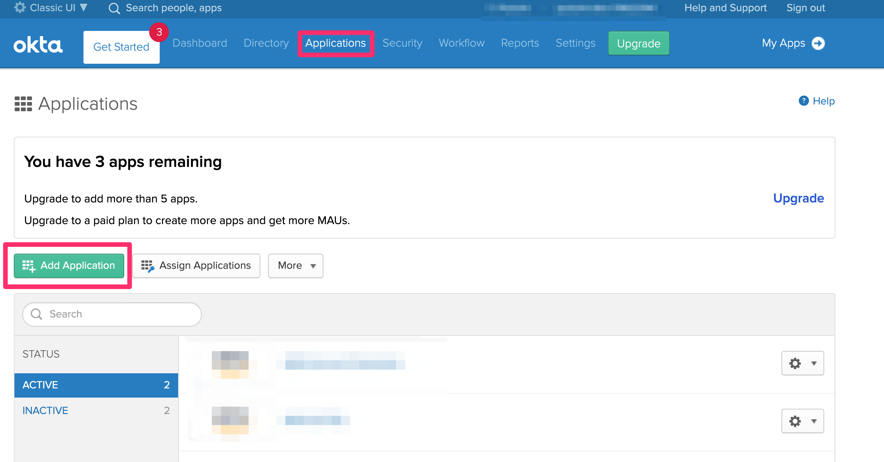

* **Pre-Requisites**

1.  Sign up for a okta [developer account](https://developer.okta.com/)

2.  Make sure you are in the developer console.  Click on `Add Person` box.

    

3. Switch over to Developer Console -> **Classic UI**
- Go to the top left where it says: `Developer Console`
- Click the drop down and select **Classic UI**`
- Click on `Applications` -> `Add Application`

    

4. Search for `AWS`.  You want `AWS Account Federation`

    

5. Now you can run your `pulumi` code.

6. Validation: Stay in the `Classic UI` -> `Applications` -> Click on your application name that shows up.