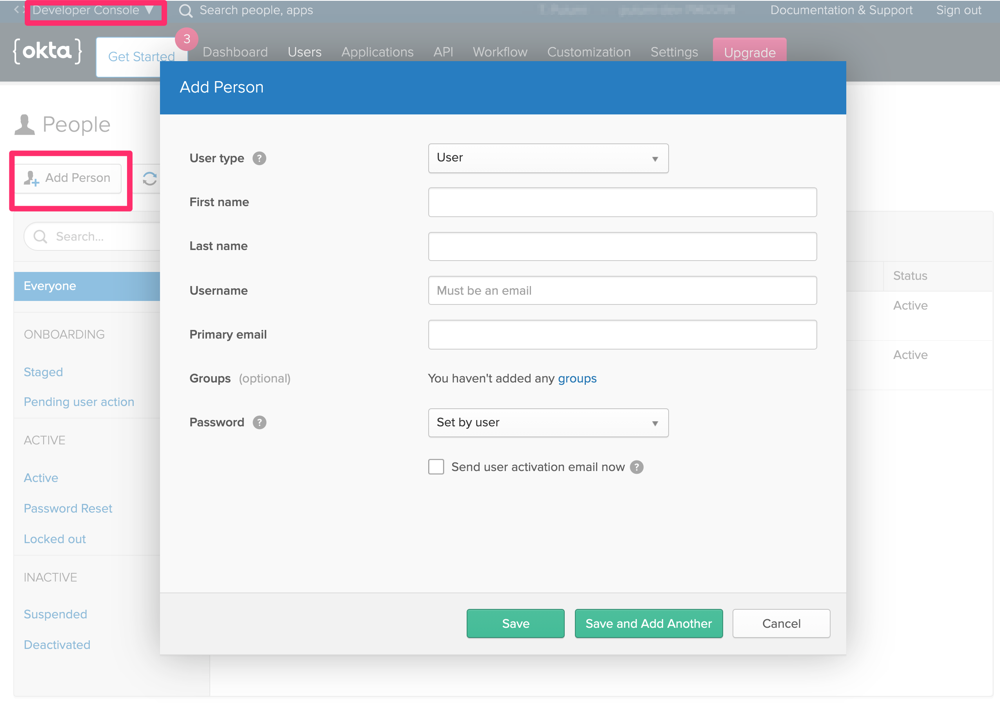
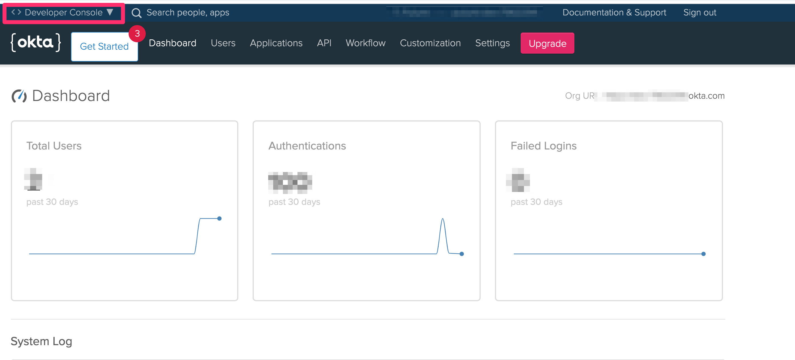
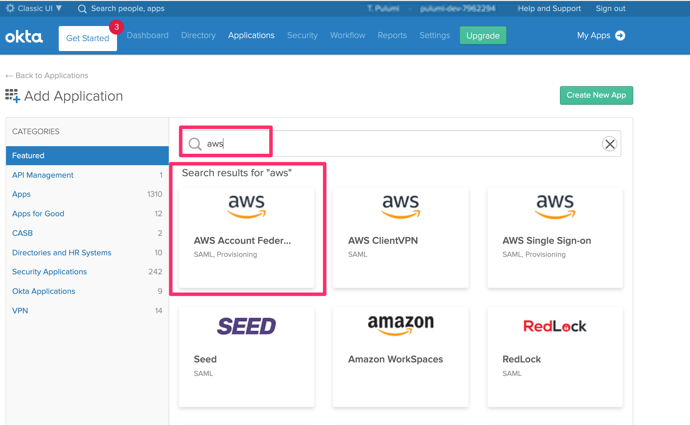
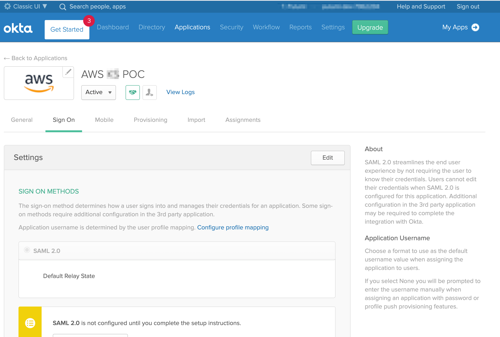

* **Pre-Requisites**

1.  Sign up for a okta [developer account](https://developer.okta.com/)

2.  Make sure you are in the developer console.  Click on `Add Person` box.

    
- Check your user inbox email and validate the account.

3. Switch over to **Classic UI**
- Go to the top left where it says: `Developer Console`.  Click on the drop down and select **Classic UI**

    

4. Add applications while in **Classic UI** mode ->
- Click on `Applications` -> `Add Application`

    

5. Search for `AWS`.  You want `AWS Account Federation`

    

6. Now you can run your `pulumi` code.

** Validation Steps **

7. Select your application
    - Stay in the **Classic UI** console-> `Applications` -> Click on your application name that shows up.  For Example:  AWS ** POC

        

8. Click on `Sign On` and validate your settings by scrolling down.

            